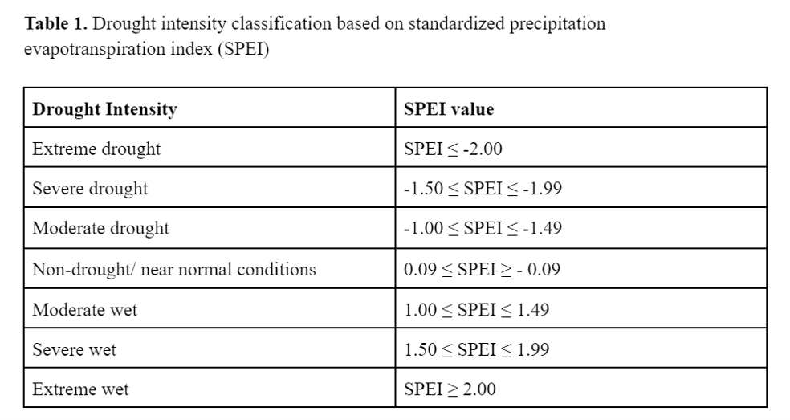
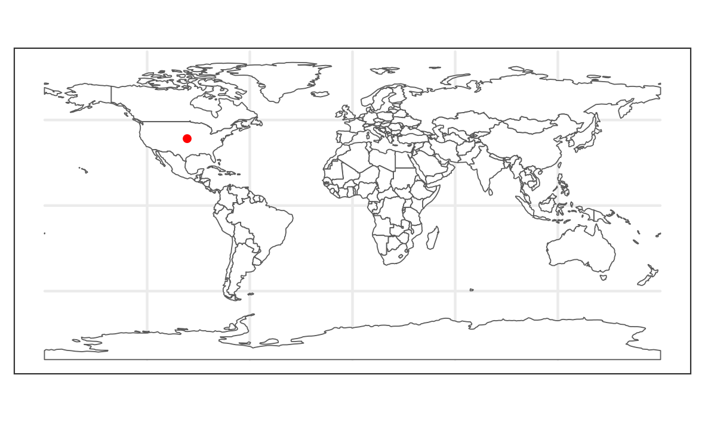
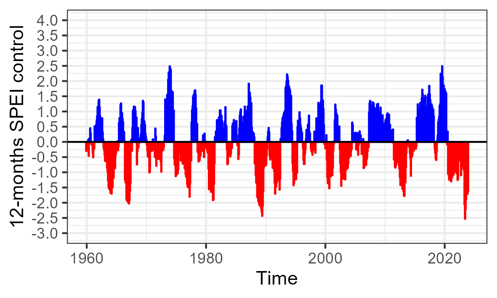
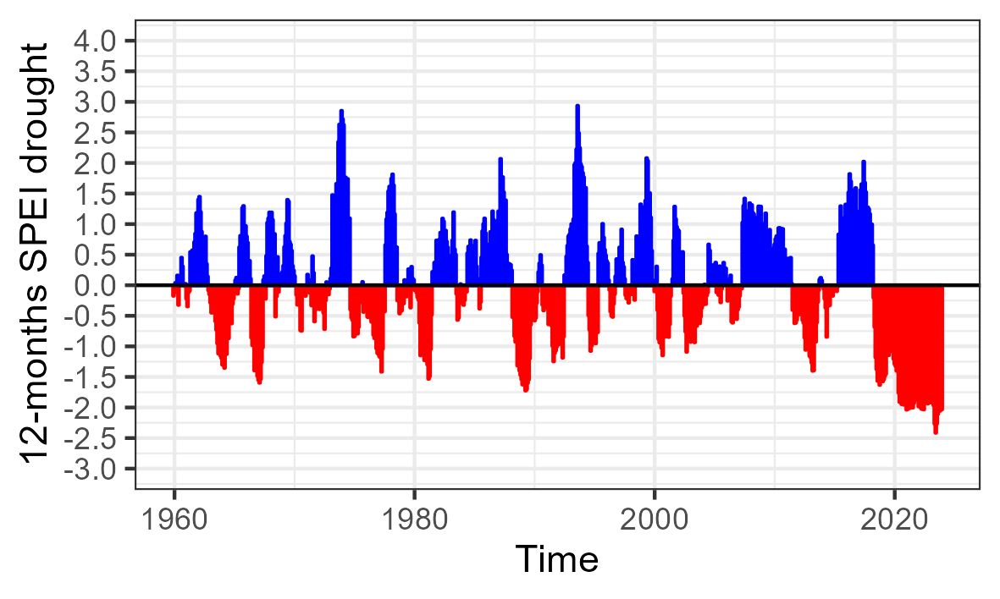
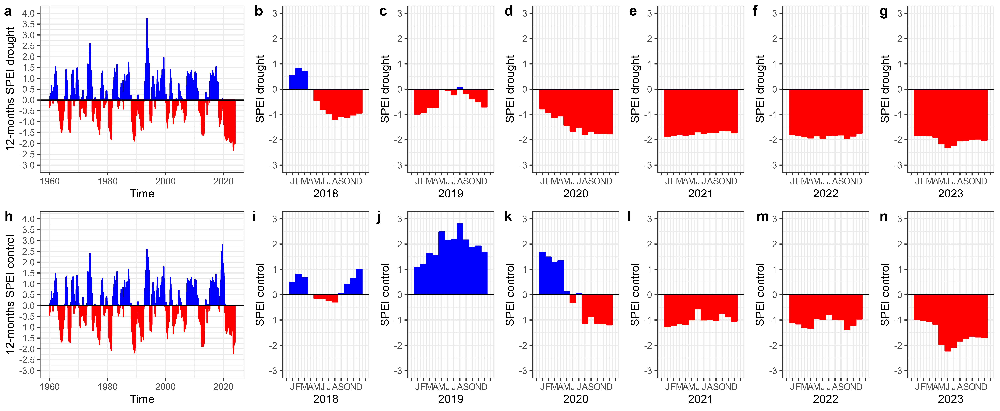

<!-- Improved compatibility of back to top link: See: https://github.com/othneildrew/Best-README-Template/pull/73 -->
<a name="readme-top"></a>
<!--
*** Thanks for checking out the Best-README-Template. If you have a suggestion
*** that would make this better, please fork the repo and create a pull request
*** or simply open an issue with the tag "enhancement".
*** Don't forget to give the project a star!
*** Thanks again! Now go create something AMAZING! :D
-->


<!-- PROJECT SHIELDS -->
<!--
*** I'm using markdown "reference style" links for readability.
*** Reference links are enclosed in brackets [ ] instead of parentheses ( ).
*** See the bottom of this document for the declaration of the reference variables
*** for contributors-url, forks-url, etc. This is an optional, concise syntax you may use.
*** https://www.markdownguide.org/basic-syntax/#reference-style-links
-->


<h3 align="center">SPEI - Standardized Precipitation Evapotransporation Index</h3>

  <p align="center">
   Data and Rcode to reproduce analysis of the manuscript entitled "On the need to use proper metrics to detect experimental drought treatments"
    <br />
    <a href="https://github.com/ilamatos/spei"><strong>Explore the docs »</strong></a>
    <br />
    <br />
    <a href="https://github.com/ilamatos/spei">View Demo</a>
    ·
    <a href="https://github.com/ilamatos/spei/issues">Report Bug</a>
    ·
    <a href="https://github.com/ilamatos/spei/issues">Request Feature</a>
  </p>
</div>


<!-- TABLE OF CONTENTS -->
<details>
  <summary>Table of Contents</summary>
    <li>
      <a href="#about-the-project">About the project </a>
      </ul>
    <li>
      <a href="#getting-started">Getting Started</a>
      </ul>
        <li><a href="#prerequisites">Prerequisites</a></li>
        <li><a href="#installation">Installation</a></li>
      </ul>
    </li>
  <li>
      <a href="#statistical-analysis">Statistical Analysis</a>
    </ul>
    <li><a href="#contact">Contact</a></li>
    <li><a href="#references">References</a></li>
  </ol>
</details>


<!-- ABOUT THE PROJECT -->
## About The Project
Rainfall manipulation experiments are a powerful tool to investigate how drought in isolation or combined with other stresses and disturbance drivers (e.g., fire, herbivory, heatwaves) affects diverse ecological processes. Using passive rainout shelters (intercepting a fixed amount of precipitation) coupled with control plots (receiving ambient precipitation), hundreds of studies have greatly advanced our understanding of drought impacts on plant and soil communities. Despite the existence of guidelines of how to properly design and implement experimental droughts, methodological issues still hinder a correct interpretation of some rainfall manipulation studies. Because of the use of improper metrics to detect drought intensity, it is sometimes unclear whether drought plots really experienced dry conditions and whether control plots experienced near-average mean annual precipitation throughout the experimental period. Here, we reanalyzed three recently published rainfall manipulation studies to illustrate how multi-scalar drought indices (such as SPEI) can be used to better quantify the intensity of the experimental drought imposed and to place it in the historical climate context of each studied area. We also provide additional guidelines to improve the experimental design of future rainfall manipulation studies.

<!-- GETTING STARTED -->
## Getting Started

### Prerequisites

You will need R version 4.3.1 (or greater) and the R-packages listed below installed and loaded in your computer to run the Rcode to reproduce the analysis of this project

### Installation

1. Clone the repo
   ```sh
   git clone https://github.com/ilamatos/spei.git
   ```
2. Install the necessary R-packages
   ```sh
   install.packages(c("tidyverse", "lubridate", "ggpubr", "ggpmisc", "SPEI", "sf, "rnaturalearth", "remotes", "pacman"))
   ```
   Some packages may need to be installed from the source
   
    ```sh
   # installing climateR package 
   library(remotes)
   remotes::install_github("mikejohnson51/AOI")

   # loading all necessary packages
   library(pacman)
   pacman::p_load(tidyverse, lubridate, ggpubr, ggpmisc, SPEI, sf, rnaturalearth, climateR) 
    
   ```

<p align="right">(<a href="#readme-top">back to top</a>)</p>

<!-- STATISTICAL ANALYSIS -->
## Statistical analysis

SPEI is an easy and more reliable metric to compare drought treatments across years and sites. SPEI takes into account the historical precipitation record for each location (Slette et al., 2019) and measures the number of standard deviations by which the climatic water balance (precipitation minus potential evapotranspiration) deviates from the historical monthly mean for a specific site (Vicente-Serrano et al., 2010). Negative SPEI values indicate drier conditions than the average, while positive SPEI values suggest wetter conditions (see Table below). 

<!-- TABLE 1 -->
<br />
<div align="left">
  <a href="https://github.com/ilamatos/spei">
    
  </a>

To calculate SPEI for a given study area, a historical record of monthly precipitation and potential evapotranspiration is required.
In this tutorial, we use climatic water balance data from TerraClimate (https://www.climatologylab.org/terraclimate.html), which provides long-term data (1959-present) at a spatial resolution of 2.5 arc minutes (~ 4 km; Abatzoglou et al., 2018).

We use the R-package ClimateR (github/mikejohnson51/climateR) to download monthly precipitation and potential evapotranspiration data for the study area of Keen et al. (2024) study, which was conducted at Konza Prairie Biological Station (Kansas, US).

To download climate data for this study site we only need to provide: 

* []()1. Decimal coordinates for study area: 39.103784, -96.613075;
* []()2. Which variables we want to download: pr (monthly precipitation) and pet (potential evapotranspiration);
* []()3. Start date: 1959-01-01
* []()4. End date: 2023-12-31

First, we need to use the code below to convert the study area coordinates into a spatial (sf) object
```sh
# create a dataframe with study area coordinates
site_coord <- data.frame(name = "Konza", 
                     lon = -96.613075, 
                     lat = 39.103784)

# convert the dataframe into a sf object
site_sf <- sf::st_as_sf(site_coord, 
                       coords = c("lon", "lat"),
                       crs = 4269) 
```
It is always a good idea to plot the point coordinates into a map to double check if the location is correct
```sh
# get the global map
world <- rnaturalearth::ne_countries(scale = "small",
                                     returnclass = "sf")

# then plot point coordinates in it
ggplot() +
  geom_sf(data = world,
          mapping = aes(geometry = geometry),
          fill = "white") +
  geom_sf(data = site_sf,
          aes(geometry = geometry),
          size = 3,
          color = "red") +
  theme_bw()
```
<!-- FIGURE 1 -->
<br />
<div align="left">
  <a href="https://github.com/ilamatos/spei">
    
  </a>

Next, we use the getTerraClim function from the ClimateR package to download TerraClimate data for the study site

```sh
dt_Konza <- getTerraClim(AOI = site_sf, #Konza prairie coordinates
                      varname = c("ppt","pet"), # variables to be downloaded
                      startDate = "1959-01-01", # start date
                      endDate  = "2023-12-31") # end date
```
This download may take a while, please be patient!

The code above can be easily modified to download data for multiple points (i.e. multiple experimental sites) or an entire area of interest. For more details, please see ClimateR documentation at https://github.com/mikejohnson51/climateR.

Once we have the climate data, we can use the code below to create the month and year columns

```sh
dt <- dt_Konza %>% mutate(date = parse_date_time(date, 'ymd')) %>% 
  mutate(year=year(date), month=month(date))%>%
  mutate( pet=pet_total*0.1, pr = ppt_total)%>% # rescale variables 
  select(date,year,month,pet,pr)
```

Note that some variables (such as pet) need to be rescaled. Please check https://code.earthengine.google.com/dataset/IDAHO_EPSCOR/TERRACLIMATE to see which variables need rescaling and which scale factors to use.

Since we want to calculate SPEI using the precipitation data for both the control and drought plots, we create a new column (pr_drought) to store the montlhy precipitation values for the drought plots.

In  Keen et al., (2024) study, rainout shelters were used to intercepted ~50% of the income annual precipitation from 2018 onwards. Shelters were only temporarily removed during mid-February to mid-March, when vegetation was burned. 

Therefore, we used the code below to create the pr_drought columns, were we halved the monthly precipitation values in the drought plots from Jan 2018 to Dec 2023, without altering precipitation values for Feb-Mar months.

```sh
# half the monthly precipitation values from 2018-2023
dt<-dt_Konza%>% mutate(pr_drought = ifelse(year == 2018 | year == 2019 | year == 2020 |
                                         year == 2021 | year == 2022 | year == 2023, pr/2, pr))

# then, for Feb and Mar months change ppt back to original values
dt[710,6]<-18.1 # Feb 2018
dt[711,6]<-38.5 # Mar 2018
dt[722,6]<-35.3 # Feb 2019
dt[723,6]<-83.8 # Mar 2019
dt[734,6]<-18.8 # Feb 2020
dt[735,6]<-58.6 # Mar 2020
dt[746,6]<-8.2 # Feb 2021
dt[747,6]<-91.6 # Mar 2021
dt[758,6]<-7.6 # Feb 2022
dt[759,6]<-57.7 # Mar 2022
dt[770,6]<-27.7 # Feb 2023
dt[771,6]<-33.2 # Mar 2023
```

Now, we use the SPEI R package (Vicente-Serrano et al., 2010) to calculate the 12-month derivation of SPEI for both the original (i.e. reflecting conditions in the control plots) and the modified (i.e. reflecting conditions in the drought plots) climate datasets. 

```sh
# first calculate climate water balance  = precipitation (pr) minus evapotranspiration (pet)

dt$bal <- dt$pr - dt$pet # climate water balance for control plots
dt$bald <- dt$pr_drought - dt$pet # climate water balance for drought plots

# convert climate data to a time series for convenience
dt_ts<- ts(dt[,-c(1,2)],start= c(1959,1),end= c(2023, 12), frequency=12)

# calculate 12-months SPEI
spei12c <- spei(dt_ts[,"bal"],12) # control plots
spei12d <- spei(dt_ts[,"bald"],12) # drought plots
```
Using the code below We can plot the SPEI time-series for the 1959-2023 reference period for the control plots (i.e. original climate dataset)

```sh
dtc <- spei12c$fitted
kk <- as.data.frame(dtc)
kk$time <- as.character(time(dtc))
kk <- melt(kk, id.vars = "time")
kk$time <- as.numeric(kk$time)
kk$na <- as.numeric(ifelse(is.na(kk$x), 0, NA))
kk$cat <- ifelse(kk$x > 0, "neg", "pos")

p1<-ggplot(kk, aes(.data[["time"]], .data[["x"]],
                    fill = cat,
                    color = cat))+
  geom_bar(stat = "identity")+  
      scale_fill_manual(values=c('blue','red')) +  # classic SPEI look
      scale_color_manual(values=c('blue','red')) + # classic SPEI look
  geom_hline(yintercept = 0, color = "black")+
  theme_bw()+
  scale_y_continuous(limits = c(-3, 4), breaks = c(-3, -2.5, -2, -1.5, -1, -0.5, 0, 0.5, 1, 1.5, 2, 2.5, 3, 3.5, 4))+
  ylab("12-months SPEI control") +
  xlab("Time") +
  theme(
    legend.position = "none",
    strip.background = element_blank(),
    strip.text = element_text(hjust = 0));p1
```
<!-- FIGURE 2 -->
<br />
<div align="left">
  <a href="https://github.com/ilamatos/spei">
    
  </a>

We can modify the code above (by replacing spei12c$fitted with spei12d$fitted in the first line of code) and then plot the SPEI time-series for the drought plots (see below)

<!-- FIGURE 3 -->
<br />
<div align="left">
  <a href="https://github.com/ilamatos/spei">
    
  </a>

Finally, we can also slice the time series data and make SPEI plots for each experimental year.
For example, the code below allow us to plot SPEI for the control plot in 2022.

```sh
# Use the window function to slice the time-series for the experimental period (2018-2023)
ee<-window(spei12c$fitted, start = c(2018,1), end=c(2023,12))
eec<-as.data.frame(ee)%>%mutate(year = rep(2018:2023, each=12), time = rep(1:12, times = 6))
glimpse(eec)

## Plot SPEI for the control plot in 2022
d22<-eec%>%filter(year == "2022")
d22$cat <- ifelse(d22$x > 0, "neg", "pos")

p2<-ggplot(data = d22, aes(x=time, y=x,  fill = cat, color = cat))+
  geom_bar (stat="identity") +
  theme_bw()+
  #ylim(c(-3.5,3.5))+
  scale_fill_manual(values=c('blue','red')) +  # classic SPEI look
  scale_color_manual(values=c('blue','red')) + # classic SPEI look
  geom_hline(yintercept = 0, color = "black")+
  scale_y_continuous(limits = c(-3,3), breaks = c(-3, -2, -1, 0, 1, 2, 3))+
  scale_x_continuous(limits = c(0,13), breaks = seq(0, 13, by = 1), labels = c("", "J", "F", "M", "A", "M", "J", "J", "A", "S", "O", "N", "D", ""))+
  xlab("2022")+ ylab ("SPEI control")+
  theme(
    legend.position = "none",
    strip.background = element_blank(),
    strip.text = element_text(hjust = 0)); p2
```
Below we can see the lomg-term (1959-2023) SPEI for both control and drougth plots, as well as individual plots showing the monthly SPEI for each experimental year (i.e. 2018-2023).

<!-- FIGURE 4 -->
<br />
<div align="left">
  <a href="https://github.com/ilamatos/spei">
    
  </a>

We see that drought treatments in the experimental drought plots progressed from non-existent (i.e. near normal conditions in 2019 with SPEI > -1.00), to moderate/severe (SPEI between -1.0 and -2.0 during 2020-2022), to extreme (in 2023 with SPEI < -2.0); whereas control plots (which were receiving ambient precipitation) were under moderate (SPEI > 1.0) to extreme (SPEI > 2.0) wet conditions at the beginning of the experiment, and then experienced a natural drought with moderate intensity (i.e. SPEI < -1.0) from mid-2021 onwards.

Finally, we also used the original TerraClimate data to calculate a rainfall seasonality index (S) for the study area. S ranges from zero (no seasonality, with rainfall uniformly distributed throughout the year) to 3.58 (maximum seasonality, with rainfall concentrated in a single month), and is calculated following Feng et al. (2013) as S = D × R/Rmax. Where, D is the relative entropy (i.e., a measure of the concentration of rainfall around the wet season), R is the long-term mean annual rainfall record for the study site, and Rmax is the maximum mean annual rainfall in the dataset (Rmax = 1,373 mm in 1973).

The code below calculates S for the study area.

```sh
# calculate rainfall seasonality 
df_map <- dt %>%
  group_by(year) %>%
  summarize(ap=sum(pr,na.rm=T)) %>% 
  summarize(map=mean(ap, na.rm=T), max_ap=max(ap,na.rm=T)) 
# map is the average mean annual precipitation for the reference period (1959-2023)
# max_ap is the maximum mean annual precipitation in the long-term record

# calculation of D
df_mmp <- dt %>% 
  group_by(month) %>%
  summarize(mmp=mean(pr,na.rm=T)) 
p_m <- df_mmp$mmp/df_map$map
int_pm <- p_m*log((p_m/(1/12)), base=2) 
D_bar <- sum(int_pm)

# calculation of S
S <- D_bar*(df_map$map/df_map$max_ap)  
S
```

Rainfall seasonality was relatively high (S = 0.14) for the study area, especially when compared to other 101 grasslands sites world-wide where rainfall manipulation experiments have been conducted (median S for those 101 sites was 0.02, ranging from 0.003 to 0.19, Matos et al. 2020).

<!-- CONTACT -->
## Contact

Ilaine Silveira Matos - ilaine.matos@gmail.com

Project Link: [https://github.com/ilamatos/spei](https://github.com/ilamatos/spei)

<p align="right">(<a href="#readme-top">back to top</a>)</p>

<!-- REFERENCES -->
## References

* []()Abatzoglou et al. (2018) Scientific Data
* []()Feng et al. (2013) Nature Climate Change
* []()Keen et al. (20124) Oecologia
* []() Matos et al. (2020) Global Change Ecology and Biogeography
* []() Rosado and Matos (2024) Oecologia (in review)
* []() Slette et al. (2019) Global Change Biology
* []() Vicente-Serrano et al (2010) Journal of Climate

<p align="right">(<a href="#readme-top">back to top</a>)</p>


<!-- MARKDOWN LINKS & IMAGES -->
<!-- https://www.markdownguide.org/basic-syntax/#reference-style-links -->
[contributors-shield]: https://img.shields.io/github/contributors/ilamatos/xylem_implosion_safety.svg?style=for-the-badge
[contributors-url]: https://github.com/ilamatos/xylem_implosion_safety/graphs/contributors
[forks-shield]: https://img.shields.io/github/forks/ilamatos/xylem_implosion_safety.svg?style=for-the-badge
[forks-url]: https://github.com/ilamatos/xylem_implosion_safety/network/members
[stars-shield]: https://img.shields.io/github/stars/ilamatos/xylem_implosion_safety.svg?style=for-the-badge
[stars-url]: https://github.com/ilamatos/xylem_implosion_safety/stargazers
[issues-shield]: https://img.shields.io/github/issues/ilamatos/xylem_implosion_safety.svg?style=for-the-badge
[issues-url]: https://github.com/ilamatos/xylem_implosion_safety/issues
[license-shield]: https://img.shields.io/github/license/ilamatos/xylem_implosion_safety.svg?style=for-the-badge
[license-url]: https://github.com/ilamatos/xylem_implosion_safety/blob/master/LICENSE.txt
[linkedin-shield]: https://img.shields.io/badge/-LinkedIn-black.svg?style=for-the-badge&logo=linkedin&colorB=555
[linkedin-url]: https://linkedin.com/in/linkedin_username
[product-screenshot]: images/screenshot.png
[Next.js]: https://img.shields.io/badge/next.js-000000?style=for-the-badge&logo=nextdotjs&logoColor=white
[Next-url]: https://nextjs.org/
[React.js]: https://img.shields.io/badge/React-20232A?style=for-the-badge&logo=react&logoColor=61DAFB
[React-url]: https://reactjs.org/
[Vue.js]: https://img.shields.io/badge/Vue.js-35495E?style=for-the-badge&logo=vuedotjs&logoColor=4FC08D
[Vue-url]: https://vuejs.org/
[Angular.io]: https://img.shields.io/badge/Angular-DD0031?style=for-the-badge&logo=angular&logoColor=white
[Angular-url]: https://angular.io/
[Svelte.dev]: https://img.shields.io/badge/Svelte-4A4A55?style=for-the-badge&logo=svelte&logoColor=FF3E00
[Svelte-url]: https://svelte.dev/
[Laravel.com]: https://img.shields.io/badge/Laravel-FF2D20?style=for-the-badge&logo=laravel&logoColor=white
[Laravel-url]: https://laravel.com
[Bootstrap.com]: https://img.shields.io/badge/Bootstrap-563D7C?style=for-the-badge&logo=bootstrap&logoColor=white
[Bootstrap-url]: https://getbootstrap.com
[JQuery.com]: https://img.shields.io/badge/jQuery-0769AD?style=for-the-badge&logo=jquery&logoColor=white
[JQuery-url]: https://jquery.com 
